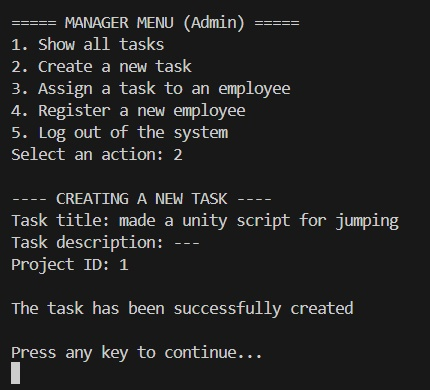
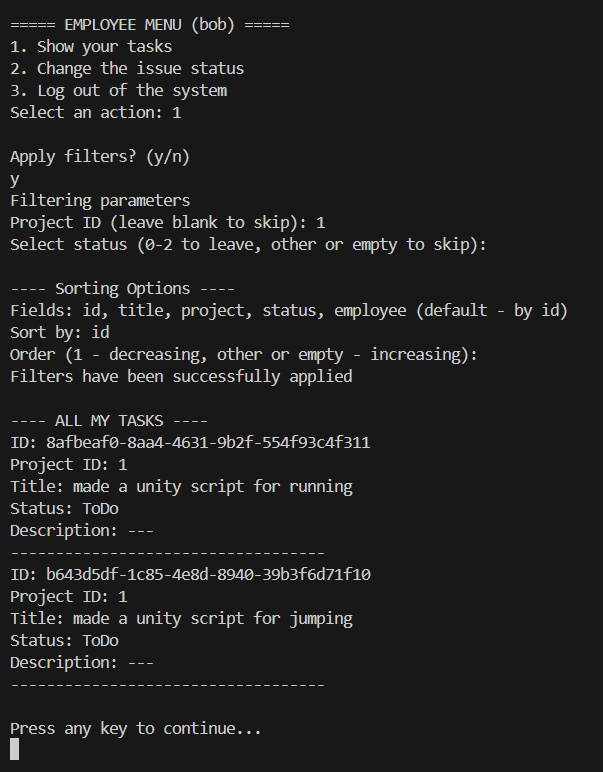

# Консольное приложение управления задачами в проектах
Проект представляет собой консольное приложение для управления задачами и сотрудниками с ролевой системой доступа. Реализованы ключевые возможности:
1. Аутентификация/авторизация
- Пользователи входят по логину/паролю, роли определяют доступный функционал.
2. Роли:
- `Manager`: Создание задач, их просмотр и назначение на сотрудников, регистрация новых сотрудников.
- `Employee`: Просмотр своих задач, изменение статуса (`ToDo`, `InProgress`, `Done`).
3. Задачи:
- Представляют из себя набор полей: ID, ID проекта, название, описание, статус, назначенный сотрудник.
4. Сохранение данных:
- Все данные (пользователи, задачи) хранятся в JSON-файле (db.json), независимо от сессии.
5. Обработка ошибок:
- Валидация ввода, перехват исключений (например, при неверном формате ID задачи).
Так же реализация помимо базового функционала имеет некоторые особенности, которые мы рассмотрим ниже.
## Особенности реализации
1. **Фильтрация и сортировка задач**
- Для менеджера: фильтры по ID проекта, статусу, сотруднику.
- Для сотрудника: фильтры по ID проекта и статусу.
- Сортировка по любому полю (id, title, project, status, employee), а также возможность выбрать будет ли сортировка по возрастанию, либо по убыванию.
2. **Логирование действий**
- Запись в файл при изменении статуса задачи (формат: `[Время] - [Пользователь] изменил статус задачи [ID] на [Статус]`).
3. **DI (Dependency Injection)**
- Все сервисы разбиты на интерфейсы (`IUserService`, `IProjectService`, `ILog`, `IDataStorage`, `IPasswordService` и другие) и их реализации (`UserService`, `ProjectService`, `FileLogger`, `JsonStorage`, `PasswordService` соответственно), что упрощает тестирование и замену реализаций, в соответствии с принципами SOLID.
```c#
//ProjectService.cs
...
private readonly IDataStorage _storage;
private readonly IUserService _userService;

public ProjectService(IDataStorage storage, IUserService userService)
{
    _storage = storage;
    _userService = userService;
}
...
```
4. **Конфигурация через JSON**
- Реализована возможность пользователю задавать удобные места расположения базы данных и логов в `appsettings.json`, если же файл конфигурации отсутствует база данных и логи будут храниться в папке приложения.
5. **Хеширование паролей**
- Используется `PasswordHasher` из ASP.NET Core Identity, который автоматически генерирует соль и применяет алгоритм PBKDF2. Это защищает от атак перебором и утечек данных.
6. **Гибкая архитектура для масштабирования**
- `JsonStorage` реализует интерфейс `IDataStorage`, что позволяет в случае необходимости быстро и легко заменить его на любую реляционную БД (PostgreSQL, SQL Server)
7. **Слоистая структура**
- Сервисы (`AuthService`, `UserService`) инкапсулируют логику.
- За хранение данных отвечает сервис `JsonStorage` который работает непосредственно с файловой системой и является слоём работы с данными.
- Модели (`User`, `TaskForEmployee`) отвечают за корректность передаваемых данных, а также за полноту поступаемых данных.
-`UI` отвечает за консольную диалоговую систему взаимодействия с пользователем, делегируя основную работу сервисам.
- Точкой входа служит `Program`, отвечающий за работу с конфигурацией и подготовку приложения к основному запуску.

## Стек технологий и архитектура
- Язык: C#, .NET 6+.
- Хранение данных: JSON-файлы (задачи, пользователи, конфиги, логи).
- `PasswordHasher` (ASP.NET Identity): Хеширование паролей с использованием алгоритма PBKDF2 и автоматической генерацией соли.
- Паттерны проектирования, которые были использованы во время создания приложения:
    - **DI** (Dependency Injection): Зависимости внедряются через конструкторы.
    - **Repository**: `JsonStorage` инкапсулирует работу с данными, изолируя бизнес-логику от деталей хранения и позволяя центролизованно управлять операциями с данными.
    - **Strategy**: Фильтрация задач через параметры `TaskFilter`, что позволяет гибко настраивать фильтрацию без изменения основного кода, а также легко добавлять новые критерии фильтрации при необходимости.
    - **Facade**: `ConsoleUI` упрощает взаимодействие с комплексом сервисов, что уменьшает связность между компонентами.

## Запуск проекта
1. Клонируем репозиторий
```bash
git clone https://github.com/Tulen4ick/project-management-system.git
cd project-management-system
```
2. Сборка проекта
```bash
dotnet build
```
3. Запуск проекта
```bash
dotnet run
```
## Пример рабочей сессии
- **Менеджер**
1. Первичный вход
<br>
<br>
<br>
2. Регистрация сотрудника
<br>
3. Создание задач
<br>
<br>
<br>
4. Просмотр всех задач
<br>
5. Назначение задач на сотрудника
<br>
<br>
<br>
6. Выход из системы
<br>
- **Сотрудник**
1. Вход в систему
<br>
<br>
2. Просмотр своих задач
<br>
3. Фильтрация по проекту
<br>
4. Изменение статуса задачи
<br>
5. Выход из системы
<br>
